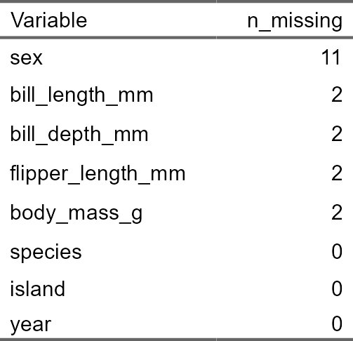
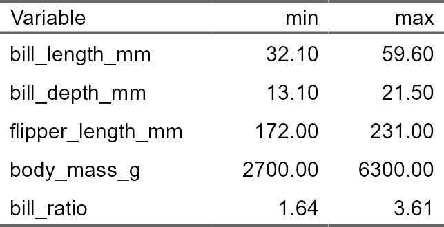
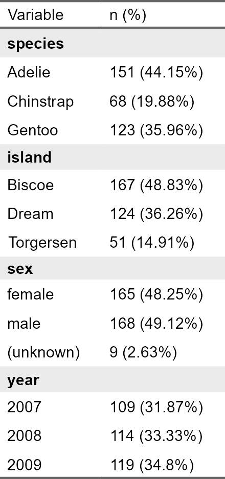
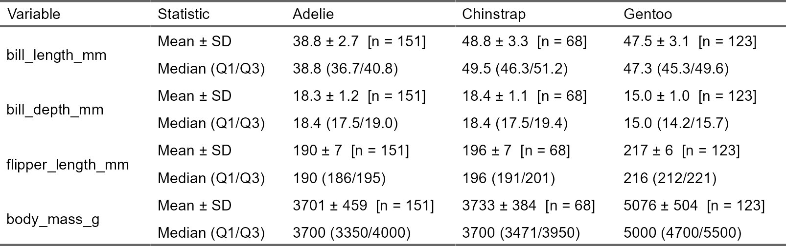
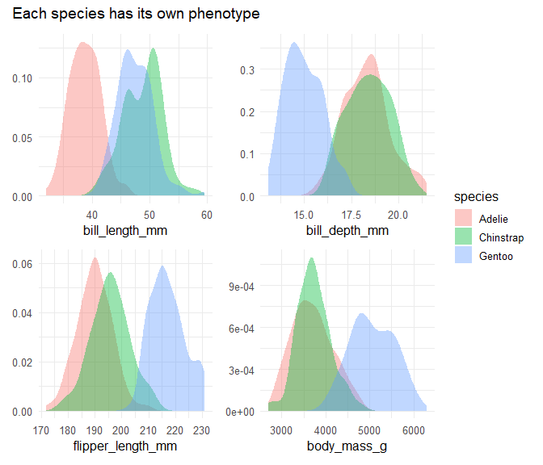
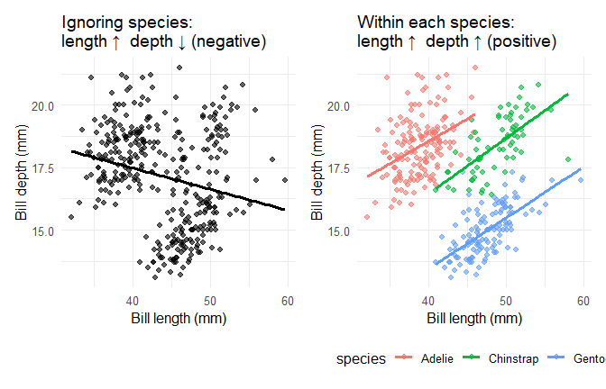
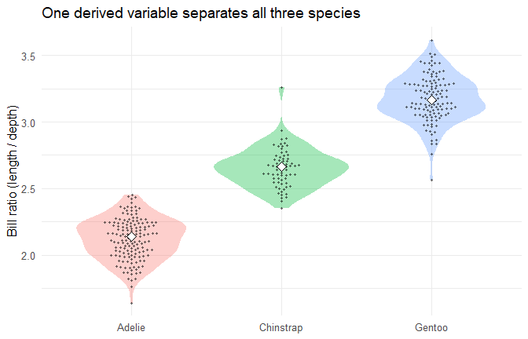
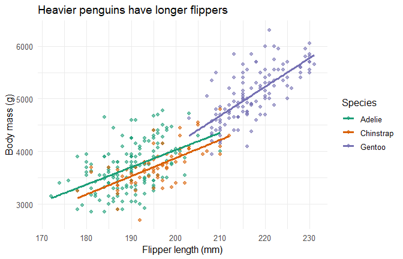
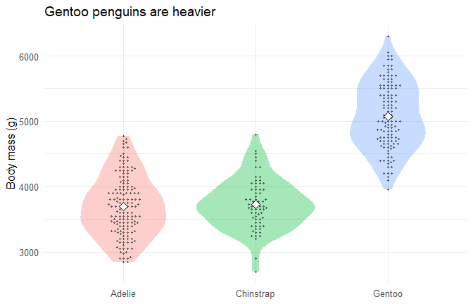
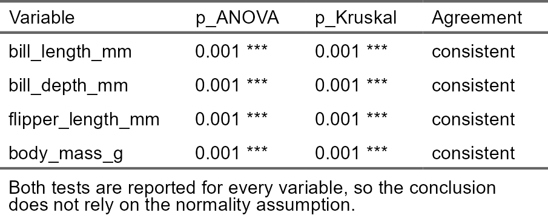

# Palmer Penguins — Data Cleaning, Visualisation & Statistical Inference
Lauriane Pous

- [Goal of this script](#goal-of-this-script)
- [Setup](#setup)
- [1. First look & cleaning](#1-first-look--cleaning)
- [2. Descriptive statistics](#2-descriptive-statistics)
- [3. Visualization](#3-visualization)
  - [Distributions by species](#distributions-by-species)
  - [Bill shape as an illustration of Simpson’s
    paradox](#bill-shape-as-an-illustration-of-simpsons-paradox)
  - [Bill ratio: combination of 2 varibles in
    1](#bill-ratio-combination-of-2-varibles-in-1)
  - [Flipper length vs body mass](#flipper-length-vs-body-mass)
  - [Body mass by species](#body-mass-by-species)
- [4. Inferential statistics](#4-inferential-statistics)
  - [4.1 Are the measurements normally distributed within each
    species?](#41-are-the-measurements-normally-distributed-within-each-species)
  - [4.2 Do the measurements differ between
    species?](#42-do-the-measurements-differ-between-species)
  - [4.3 Sexual dimorphism in body mass (two-sample
    t-test)](#43-sexual-dimorphism-in-body-mass-two-sample-t-test)
  - [4.4 Is sex distributed equally across species?
    (chi-square)](#44-is-sex-distributed-equally-across-species-chi-square)
  - [4.5 Flipper length vs body mass
    (correlation)](#45-flipper-length-vs-body-mass-correlation)
- [Summary](#summary)

## Goal of this script

The Palmer Penguins dataset records body measurements for three penguin
species (*Adelie*, *Chinstrap*, *Gentoo*) collected on three islands of
the Palmer Archipelago. I use it here as a compact end-to-end
demonstration of how I approach a fresh dataset:

1.  inspect and **clean** the data (types, missing values,
    plausibility),
2.  **describe** it with the right summaries for each variable type,
3.  **visualize** the structure to generate hypotheses,
4.  test those hypotheses with appropriate **inferential statistics**.

The aim is not to discover anything new about penguins, but to show a
clean and reproducible workflow.

## Setup

Everything loads from packages, so the script is fully reproducible, no
local files involved.

``` r
# pacman installs (if missing) and loads everything in one call — reproducible on any machine
if (!requireNamespace("pacman", quietly = TRUE)) install.packages("pacman")
pacman::p_load(
  conflicted,
  tidyverse,        # dplyr, tidyr, ggplot2, purrr, stringr, forcats
  palmerpenguins,   # the dataset
  wrappedtools,     # meansd(), median_quart(), formatP(), cat_desc_table()
  flextable,        # publication-ready tables
  patchwork,        # compose ggplots
  ggbeeswarm        # jittered points without overlap
)

conflicts_prefer(dplyr::filter, dplyr::select, dplyr::lag, .quiet = TRUE)

theme_set(theme_minimal(base_size = 12))
set_flextable_defaults(background.color = "white")

# the two groups of variables used throughout the script — defined once, reused everywhere
cont_vars <- c("bill_length_mm", "bill_depth_mm", "flipper_length_mm", "body_mass_g")
cat_vars  <- c("species", "island", "sex", "year")
```

## 1. First look & cleaning

``` r
raw <- palmerpenguins::penguins
glimpse(raw)
```

    Rows: 344
    Columns: 8
    $ species           <fct> Adelie, Adelie, Adelie, Adelie, Adelie, Adelie, Adel…
    $ island            <fct> Torgersen, Torgersen, Torgersen, Torgersen, Torgerse…
    $ bill_length_mm    <dbl> 39.1, 39.5, 40.3, NA, 36.7, 39.3, 38.9, 39.2, 34.1, …
    $ bill_depth_mm     <dbl> 18.7, 17.4, 18.0, NA, 19.3, 20.6, 17.8, 19.6, 18.1, …
    $ flipper_length_mm <int> 181, 186, 195, NA, 193, 190, 181, 195, 193, 190, 186…
    $ body_mass_g       <int> 3750, 3800, 3250, NA, 3450, 3650, 3625, 4675, 3475, …
    $ sex               <fct> male, female, female, NA, female, male, female, male…
    $ year              <int> 2007, 2007, 2007, 2007, 2007, 2007, 2007, 2007, 2007…

Eight columns: three factors (`species`, `island`, `sex`), one integer
that is really a grouping variable (`year`) and four continuous
measurements. Before touching anything I want to know **where the holes
are**.

``` r
raw |>
  summarise(across(everything(), ~ sum(is.na(.x)))) |>
  pivot_longer(everything(), names_to = "Variable", values_to = "n_missing") |>
  arrange(desc(n_missing)) |>
  flextable() |>
  theme_booktabs() |>
  autofit() |>
  set_caption("Missing values per variable")
```



2 patterns: `sex` is missing for 11 birds, and each of the four
measurements is missing for exactly 2 birds. Are those the *same* 2
birds? Rather than trusting my eyes, I check it:

``` r
# rows where every measurement is NA
raw |> filter(if_all(all_of(cont_vars), is.na))
```

    # A tibble: 2 × 8
      species island    bill_length_mm bill_depth_mm flipper_length_mm body_mass_g
      <fct>   <fct>              <dbl>         <dbl>             <int>       <int>
    1 Adelie  Torgersen             NA            NA                NA          NA
    2 Gentoo  Biscoe                NA            NA                NA          NA
    # ℹ 2 more variables: sex <fct>, year <int>

Yes — 2 penguins have **no body measurements at all**; these rows carry
no information for an analysis of size. My decisions:

- drop the 2 rows with no measurements (they cannot contribute to any
  numeric analysis),
- **keep** the birds with unknown sex — they still have valid
  measurements, so I only exclude them from sex-specific tests rather
  than throwing the whole row away.

I also recode `year` as a factor (it is a label, not a quantity) and add
one derived variable: the bill ratio (length ÷ depth), a unit-free
measure of bill *shape* rather than size, which I come back to in
section 3.

``` r
penguins <- raw |>
  mutate(
    year       = factor(year),
    bill_ratio = bill_length_mm / bill_depth_mm
  ) |>
  # remove only the rows where *all* measurements are missing
  filter(!if_all(all_of(cont_vars), is.na))

nrow(penguins)            # 342 birds kept
```

    [1] 342

``` r
sum(is.na(penguins$sex))  # 9 still have unknown sex — kept on purpose
```

    [1] 9

Last cleaning step: a quick plausibility check on the numeric ranges.
Bad units or data-entry typos usually show up here as impossible values.

``` r
penguins |>
  summarise(across(where(is.numeric), list(min = min, max = max))) |>
  pivot_longer(everything(),
               names_to = c("Variable", ".value"),
               names_pattern = "^(.*)_(min|max)$") |>
  flextable() |>
  colformat_double(digits = 2, big.mark = "") |>
  theme_booktabs() |>
  autofit() |>
  set_caption("Range of every numeric variable")
```



All ranges are biologically sensible (bills 32–60 mm long and 13–22 mm
deep, flippers 172–231 mm, mass 2.7–6.3 kg, bill ratio 1.6–3.6), so no
further correction is needed. The data is now tidy.

## 2. Descriptive statistics

**Categorical variables** are described with counts and percentages.

``` r
penguins |>
  mutate(sex = fct_na_value_to_level(sex, "(unknown)")) |>
  cat_desc_table(desc_vars = cat_vars) |>
  rename(`n (%)` = desc_all) |>
  flextable() |>
  theme_booktabs() |>
  autofit() |>
  # cat_desc_table() leaves the count empty on the variable-name rows: highlight them
  bold(~ `n (%)` == " ") |>
  bg(~ `n (%)` == " ", bg = "grey92") |>
  set_caption("Composition of the sample")
```



**Continuous variables** are summarized both as mean ± SD and as median
(Q1/Q3), split by species because, as the plots below confirm, the
species are very different animals and a pooled mean would be
misleading.

``` r
penguins |>
  group_by(species) |>
  summarise(across(all_of(cont_vars),
                   list(`Mean ± SD`      = ~ meansd(.x, roundDig = 3, add_n = TRUE),
                        `Median (Q1/Q3)` = ~ median_quart(.x, roundDig = 3)),
                   .names = "{.col}|{.fn}"),
            .groups = "drop") |>
  # one row per variable × statistic, one column per species
  pivot_longer(-species, names_to = c("Variable", "Statistic"), names_sep = "\\|") |>
  pivot_wider(names_from = species, values_from = value) |>
  flextable() |>
  theme_booktabs() |>
  merge_v(j = "Variable") |>
  autofit() |>
  set_caption("Body measurements by species")
```



## 3. Visualization

### Distributions by species

``` r
dens_plots <- map(cont_vars, function(v) {
  ggplot(penguins, aes(x = .data[[v]], fill = species)) +
    geom_density(alpha = 0.4, colour = NA) +
    labs(x = v, y = NULL)
})
# guides = "collect" merges the four identical legends into one
wrap_plots(dens_plots, ncol = 2, guides = "collect") +
  plot_annotation(title = "Each species has its own phenotype") &
  theme(legend.position = "right")
```

<div id="fig-density">



Figure 1

</div>

Flipper length, bill depth and body mass clearly separate *Gentoo* from
the other two; bill *depth* separates *Gentoo* (shallow bills) while
bill *length* separates *Adelie* (short bills).

### Bill shape as an illustration of Simpson’s paradox

``` r
p_pooled <- ggplot(penguins, aes(bill_length_mm, bill_depth_mm)) +
  geom_point(alpha = 0.6) +
  geom_smooth(method = "lm", se = FALSE, colour = "black") +
  labs(title = "Ignoring species:\nlength ↑  depth ↓ (negative)",
       x = "Bill length (mm)", y = "Bill depth (mm)")

p_bysp <- ggplot(penguins, aes(bill_length_mm, bill_depth_mm, colour = species)) +
  geom_point(alpha = 0.6) +
  geom_smooth(method = "lm", se = FALSE) +
  labs(title = "Within each species:\nlength ↑  depth ↑ (positive)",
       x = "Bill length (mm)", y = "Bill depth (mm)") +
  theme(legend.position = "bottom")

p_pooled + p_bysp
```

<div id="fig-simpson">



Figure 2

</div>

Pooled across species the 2 bill dimensions look *negatively*
correlated, but **within** every species the relationship is *positive*.
This sign reversal is a classic Simpson’s paradox: a good reminder to
always check whether a confounder (here species) is driving an
association.

### Bill ratio: combination of 2 varibles in 1

In the scatter plot above, each species forms its own cloud of points,
and what sets them apart is the proportion between bill length and depth
rather than either value alone. That is what the bill ratio from the
cleaning step captures

``` r
ggplot(penguins, aes(species, bill_ratio, fill = species)) +
  geom_violin(alpha = 0.35, colour = NA) +
  geom_beeswarm(alpha = 0.45, size = 0.8) +
  stat_summary(fun = median, geom = "point", shape = 23, size = 3, fill = "white") +
  labs(title = "One derived variable separates all three species",
       x = NULL, y = "Bill ratio (length / depth)") +
  theme(legend.position = "none")
```

<div id="fig-ratio">



Figure 3

</div>

Medians of 2.14 (*Adelie*), 2.66 (*Chinstrap*) and 3.17 (*Gentoo*).
Species differ in bill *shape* more than in bill *size*.

### Flipper length vs body mass

``` r
ggplot(penguins, aes(flipper_length_mm, body_mass_g, colour = species)) +
  geom_point(alpha = 0.6) +
  geom_smooth(method = "lm", se = FALSE) +
  scale_colour_brewer(palette = "Dark2") +
  labs(title = "Heavier penguins have longer flippers",
       x = "Flipper length (mm)", y = "Body mass (g)", colour = "Species")
```

<div id="fig-scatter">



Figure 4

</div>

### Body mass by species

``` r
ggplot(penguins, aes(species, body_mass_g, fill = species)) +
  geom_violin(alpha = 0.35, colour = NA) +
  geom_beeswarm(alpha = 0.45, size = 0.8) +
  stat_summary(fun = mean, geom = "point", shape = 23, size = 3, fill = "white") +
  labs(title = "Gentoo penguins are heavier", x = NULL, y = "Body mass (g)") +
  theme(legend.position = "none")
```

<div id="fig-mass">



Figure 5

</div>

## 4. Inferential statistics

### 4.1 Are the measurements normally distributed within each species?

The choice between a parametric and a non-parametric test depends on the
distribution **within each group**, so I test normality per species with
a Shapiro–Wilk test.

``` r
penguins |>
  group_by(species) |>
  summarise(across(all_of(cont_vars), ~ shapiro.test(.x)$p.value), .groups = "drop") |>
  mutate(across(-species, ~ formatP(.x, mark = TRUE))) |>
  flextable() |>
  theme_booktabs() |>
  autofit() |>
  set_caption("Shapiro–Wilk p-values for normality (per species)") |>
  add_footer_lines("p > 0.05 is compatible with a normal distribution.")
```


The picture is mixed: most combinations are compatible with normality,
but not all (Adelie body mass, and three of the four Gentoo
measurements, reject it). So I do not rely on the assumption and report
a parametric and a non-parametric test side by side in the next section.

### 4.2 Do the measurements differ between species?

``` r
# one-way ANOVA (parametric) vs Kruskal–Wallis (non-parametric) for every variable
tibble(Variable = cont_vars) |>
  mutate(
    p_ANOVA   = map_dbl(Variable, ~ oneway.test(reformulate("species", .x),
                                                data = penguins, var.equal = TRUE)$p.value),
    p_Kruskal = map_dbl(Variable, ~ kruskal.test(reformulate("species", .x),
                                                 data = penguins)$p.value),
    Agreement = if_else((p_ANOVA < 0.05) == (p_Kruskal < 0.05), "consistent", "DIFFERENT")
  ) |>
  mutate(across(starts_with("p_"), ~ formatP(.x, mark = TRUE))) |>
  flextable() |>
  theme_booktabs() |>
  autofit() |>
  set_caption("Species differences: parametric (ANOVA) vs non-parametric (Kruskal–Wallis)") |>
  add_footer_lines("Both tests are reported for every variable, so the conclusion does not rely on the normality assumption.")
```



``` r
# which pairs of species differ, and by how much? Tukey HSD controls the error rate across the 3 comparisons
map(cont_vars, function(v) {
  TukeyHSD(aov(reformulate("species", v), data = penguins))$species |>
    as_tibble(rownames = "Comparison") |>
    mutate(Variable = v, .before = 1)
}) |>
  list_rbind() |>
  mutate(across(c(diff, lwr, upr), ~ round(.x, 1)),
         `p adj` = formatP(`p adj`, mark = TRUE)) |>
  flextable() |>
  theme_booktabs() |>
  merge_v(j = "Variable") |>
  autofit() |>
  set_caption("Pairwise species differences with 95% CI (Tukey HSD)")
```


The ANOVA/KW tests only tell me that at least one species differs. To
know which pairs differ, I use Tukey’s test : it compares each pair of
species and corrects the p-values for the three comparisons made at once
(I use it rather than pairwise Wilcoxon tests because the groups are
large, so the comparison of means is robust to the mild non-normality
seen in 4.1).

Gentoo differ from both other species on every measurement. Adelie and
Chinstrap have no significant difference in body size and bill depth.

### 4.3 Sexual dimorphism in body mass (two-sample t-test)

Comparing the sexes on the *pooled* data would confound sex with
species, so I test **within a single species** (*Gentoo*). Gentoo body
mass was compatible with normality above (Shapiro p = 0.23), so a t-test
is appropriate; the default Welch version does not assume equal
variances.

``` r
gentoo <- penguins |> filter(species == "Gentoo", !is.na(sex))
t.test(body_mass_g ~ sex, data = gentoo)
```


        Welch Two Sample t-test

    data:  body_mass_g by sex
    t = -14.761, df = 116.64, p-value < 2.2e-16
    alternative hypothesis: true difference in means between group female and group male is not equal to 0
    95 percent confidence interval:
     -913.1130 -697.0763
    sample estimates:
    mean in group female   mean in group male 
                4679.741             5484.836 

Male Gentoo penguins are on average ~800 g heavier than females (95% CI
700–910 g): clear sexual dimorphism.

### 4.4 Is sex distributed equally across species? (chi-square)

A categorical-vs-categorical association test. Here I expect **no**
association: the field team sampled both sexes in every species.
`table()` drops the 9 birds of unknown sex automatically.

``` r
tab <- table(penguins$species, penguins$sex)
tab
```

               
                female male
      Adelie        73   73
      Chinstrap     34   34
      Gentoo        58   61

``` r
chisq.test(tab)
```


        Pearson's Chi-squared test

    data:  tab
    X-squared = 0.048607, df = 2, p-value = 0.976

The sexes are almost perfectly balanced within each species (p ≈ 0.98):
no association between species and sex.

### 4.5 Flipper length vs body mass (correlation)

``` r
# Pearson quantifies the linear relationship visible in the scatter plot above
cor.test(penguins$flipper_length_mm, penguins$body_mass_g, method = "pearson")
```


        Pearson's product-moment correlation

    data:  penguins$flipper_length_mm and penguins$body_mass_g
    t = 32.722, df = 340, p-value < 2.2e-16
    alternative hypothesis: true correlation is not equal to 0
    95 percent confidence interval:
     0.843041 0.894599
    sample estimates:
          cor 
    0.8712018 

A strong positive linear relationship (*r* ≈ 0.87, 95% CI 0.84–0.89),
matching the scatter plot above.

## Summary

- **Cleaning:** 2 of 344 rows had no measurements and were dropped; 9
  birds of unknown sex were kept and excluded only from sex-specific
  tests. All numeric ranges are biologically plausible.
- **Structure:** the three species have distinct phenotypes; species
  confounds the bill length–depth relationship (Simpson’s paradox), and
  the derived bill ratio separates the species better than any raw
  measurement.
- **Inference:** Gentoo differ from the other two species on every
  measurement, while Adelie and Chinstrap share the same body size and
  differ only by bill length (Tukey post hoc); Gentoo males are ~800 g
  heavier than females; sex is balanced across species; flipper length
  and body mass are strongly correlated (r ≈ 0.87).
