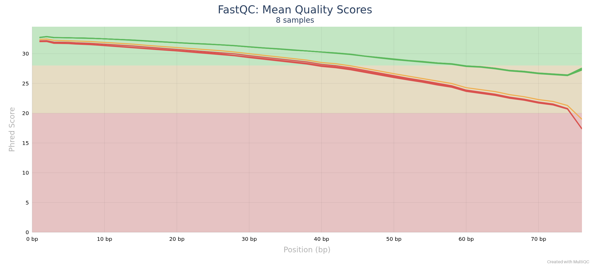
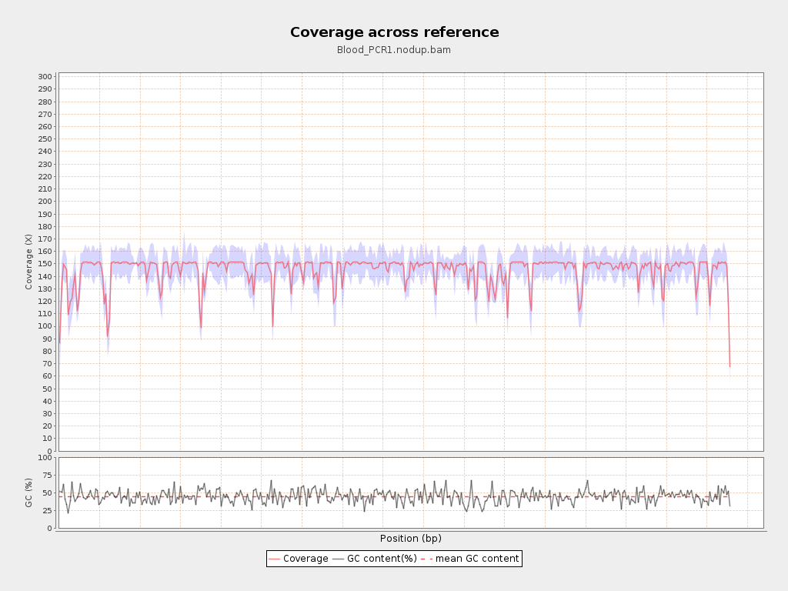
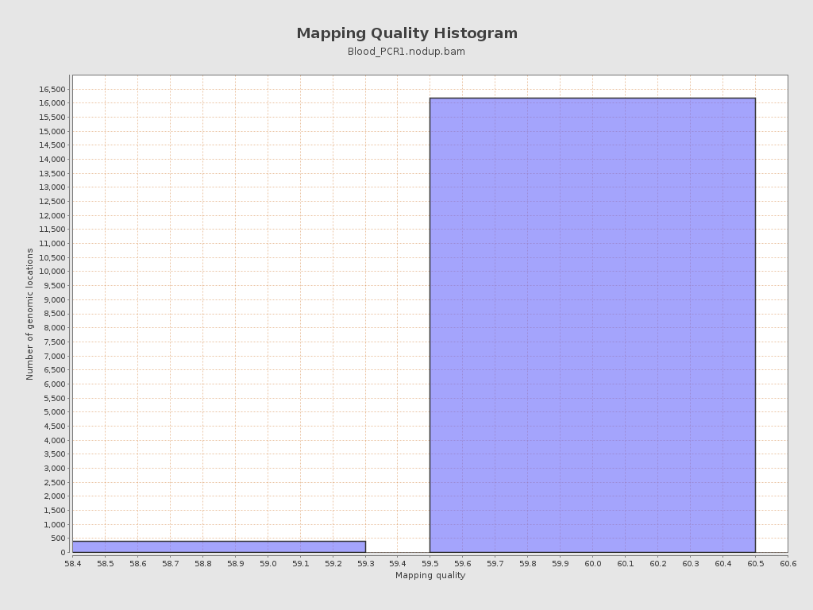
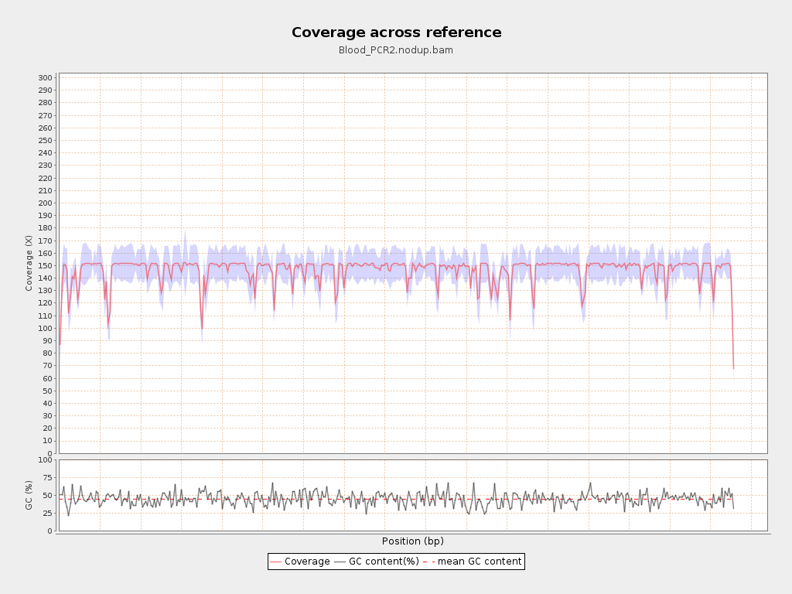
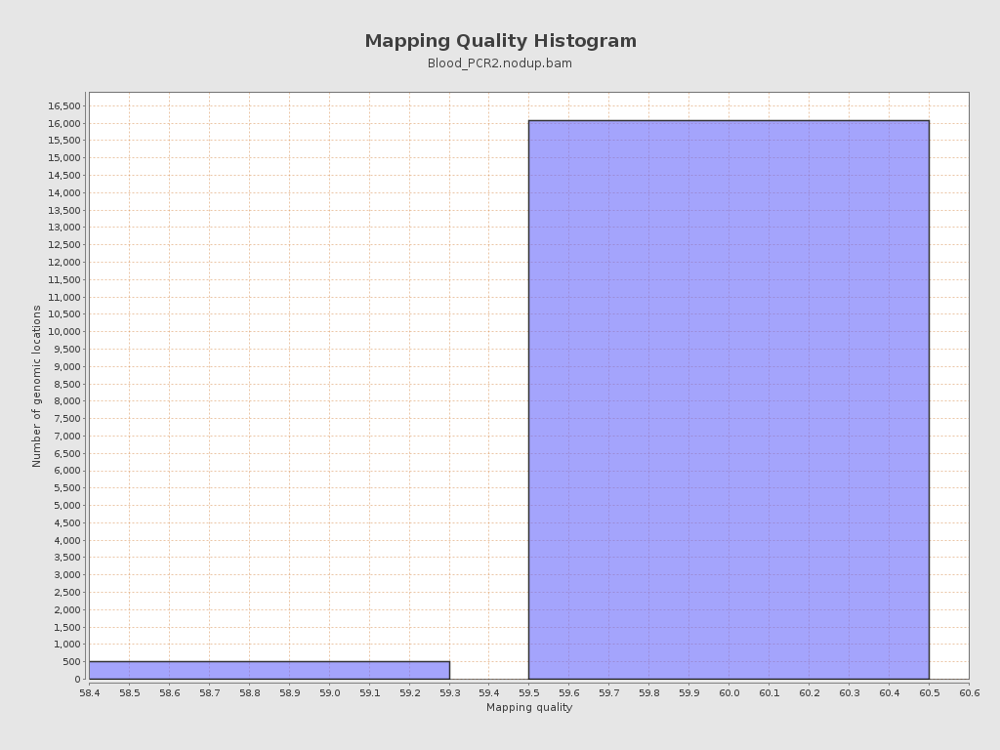
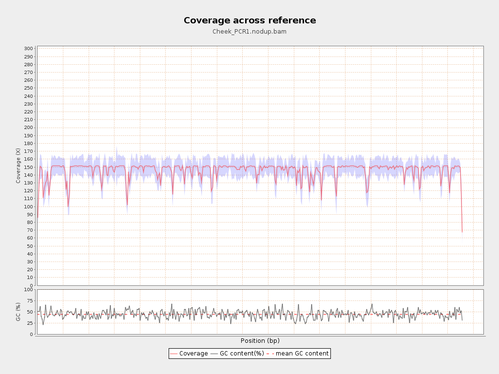
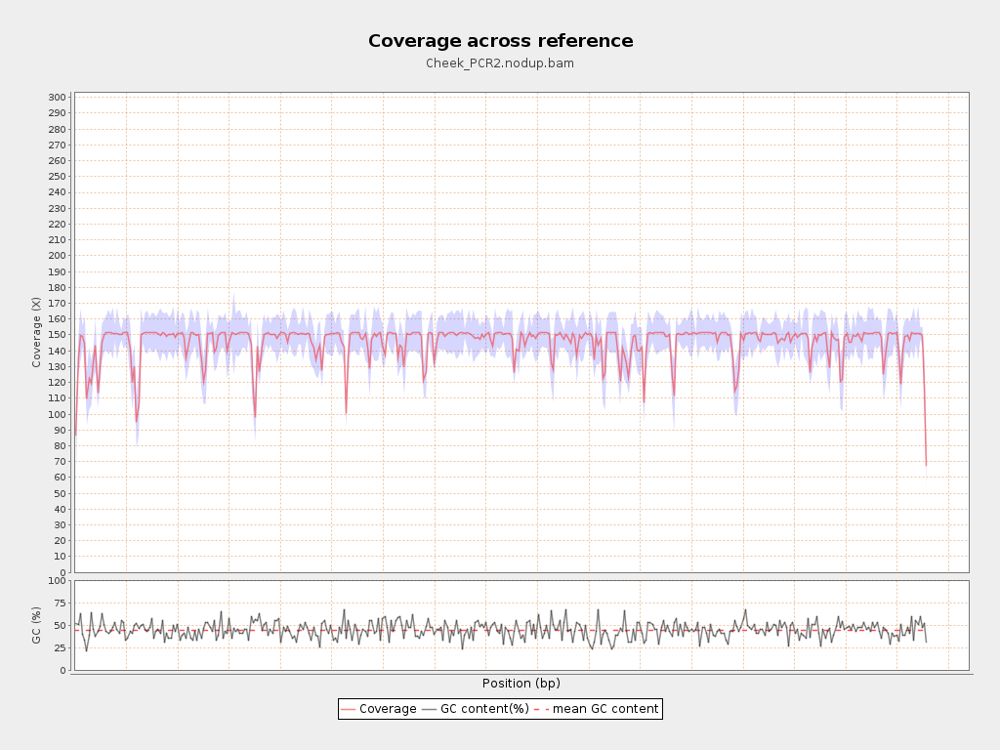
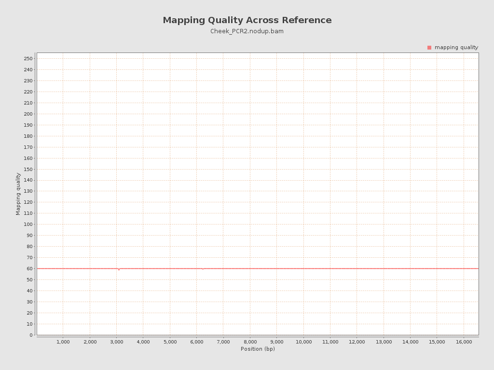

# mtDNA variant calling - summary

Samples: Blood_PCR1, Blood_PCR2, Cheek_PCR1, Cheek_PCR2. Tables and figures come from the reports of MultiQC
(FastQC raw vs trimmed), Qualimap (mapping) and FreeBayes / IGV (variants).

## Q2 - Quality of untrimmed vs trimmed reads (FastQC via MultiQC)

Source: `06_multiqc/multiqc_report.html` (table `multiqc_data/multiqc_fastqc.txt`).

| sample | reads_raw | reads_trimmed | reads_kept_pct | read_length_raw | read_length_trimmed | mean_length_raw | mean_length_trimmed |
|---|---|---|---|---|---|---|---|
| Blood_PCR1 | 502,027 | 463,821 | 92.39 | 76 | 20-76 | 76.00 | 67.50 |
| Blood_PCR2 | 880,238 | 835,878 | 94.96 | 76 | 20-76 | 76.00 | 67.80 |
| Cheek_PCR1 | 775,186 | 719,376 | 92.80 | 76 | 20-76 | 76.00 | 67.60 |
| Cheek_PCR2 | 584,539 | 548,211 | 93.79 | 76 | 20-76 | 76.00 | 67.50 |

FastQC module status, raw -> trimmed (a single value means the status did not change):

| FastQC module | Blood_PCR1 | Blood_PCR2 | Cheek_PCR1 | Cheek_PCR2 |
|---|---|---|---|---|
| Per base sequence quality | FAIL -> PASS | WARN -> PASS | FAIL -> PASS | FAIL -> PASS |
| Per tile sequence quality | FAIL | FAIL | FAIL | FAIL |
| Per sequence quality scores | PASS | PASS | PASS | PASS |
| Per base sequence content | WARN -> FAIL | PASS -> WARN | WARN -> FAIL | WARN |
| Per sequence GC content | PASS | WARN -> PASS | WARN -> PASS | PASS |
| Per base N content | PASS | PASS | PASS | PASS |
| Sequence Length Distribution | PASS -> WARN | PASS -> WARN | PASS -> WARN | PASS -> WARN |
| Sequence Duplication Levels | FAIL | FAIL | FAIL | FAIL |
| Overrepresented sequences | WARN | FAIL | WARN -> FAIL | WARN |
| Adapter Content | PASS | PASS | PASS | PASS |

## Q3/Q4 - Quality of the mapping (Qualimap BamQC on the de-duplicated BAMs)

Source: `05_qualimap/<sample>/qualimapReport.html` (`genome_results.txt`). Unmapped reads
were removed before this step (`samtools view -F 4`), so 100 % of the reads in each BAM
are mapped by construction; coverage, mapping quality and error rate are the informative metrics.

| sample | mapped_reads | mapped_pct | unmapped_reads | mean_coverage_x | breadth_of_coverage_1x_pct | mean_mapping_quality | error_rate_pct | duplication_rate_pct |
|---|---|---|---|---|---|---|---|---|
| Blood_PCR1 | 32,727 | 100.00 | 0 | 145.20 | 100.00 | 59.98 | 0.23 | 65.18 |
| Blood_PCR2 | 32,833 | 100.00 | 0 | 146.50 | 100.00 | 59.98 | 0.24 | 70.72 |
| Cheek_PCR1 | 32,775 | 100.00 | 0 | 146.00 | 100.00 | 59.98 | 0.23 | 66.67 |
| Cheek_PCR2 | 32,771 | 100.00 | 0 | 145.60 | 100.00 | 59.98 | 0.24 | 65.86 |

## Q5 - Variants (FreeBayes joint call, viewed in IGV)

- FreeBayes command: `freebayes -f chrM.fasta 04_bam/Blood_PCR1.nodup.bam 04_bam/Blood_PCR2.nodup.bam 04_bam/Cheek_PCR1.nodup.bam 04_bam/Cheek_PCR2.nodup.bam`
- Records in the VCF: 47 (complex: 1, complex,snp: 1, del: 1, ins: 1, snp: 43)
- SNP sites in the VCF (INFO TYPE=snp, incl. candidate sites that are 0/0 in every sample): 43
- Sites that are non-reference in at least one sample: 14 (of which SNPs: 12)
- IGV view of every variant (reference, VCF track, 4 BAM pileups): [igv_report.html](09_igv/igv_report.html)

Per sample (SNP sites only; the *_all_types columns also count indels/complex variants).
The samples come from one individual, so 'heterozygous' calls of the diploid model are
heteroplasmic sites (mixed mtDNA populations), not true heterozygosity.

| sample | total_snps | heterozygous | homozygous | variants_all_types | heterozygous_all_types | homozygous_all_types |
|---|---|---|---|---|---|---|
| Blood_PCR1 | 12 | 3 | 9 | 14 | 3 | 11 |
| Blood_PCR2 | 11 | 2 | 9 | 13 | 2 | 11 |
| Cheek_PCR1 | 12 | 3 | 9 | 14 | 3 | 11 |
| Cheek_PCR2 | 11 | 2 | 9 | 13 | 2 | 11 |

Genotype (alternate allele fraction) of each sample at the variant sites:

| pos | ref | alt | type | qual | Blood_PCR1 | Blood_PCR2 | Cheek_PCR1 | Cheek_PCR2 |
|---|---|---|---|---|---|---|---|---|
| 263 | A | G | snp | 12,768 | 1/1 (0.99) | 1/1 (1.00) | 1/1 (1.00) | 1/1 (1.00) |
| 309 | CTCCCCCGCT | CTCCCCCCGCT | ins | 7,716 | 1/1 (0.90) | 1/1 (0.87) | 1/1 (0.94) | 1/1 (0.96) |
| 750 | A | G | snp | 17,101 | 1/1 (1.00) | 1/1 (0.99) | 1/1 (1.00) | 1/1 (1.00) |
| 1,438 | A | G | snp | 17,706 | 1/1 (1.00) | 1/1 (1.00) | 1/1 (1.00) | 1/1 (1.00) |
| 3,010 | G | A | snp | 15,730 | 1/1 (0.96) | 1/1 (1.00) | 1/1 (0.99) | 1/1 (1.00) |
| 3,105 | ACN | AC | complex | 16,444 | 1/1 (0.97) | 1/1 (0.97) | 1/1 (0.97) | 1/1 (0.98) |
| 4,769 | A | G | snp | 16,508 | 1/1 (1.00) | 1/1 (0.99) | 1/1 (0.99) | 1/1 (0.99) |
| 8,860 | A | G | snp | 17,624 | 1/1 (0.99) | 1/1 (1.00) | 1/1 (1.00) | 1/1 (1.00) |
| 8,992 | C | T | snp | 2,330 | 0/1 (0.25) | 0/1 (0.21) | 0/1 (0.31) | 0/1 (0.32) |
| 10,306 | A | C | snp | 0 | 0/1 (0.19) | 0/1 (0.22) | 0/1 (0.19) | 0/1 (0.21) |
| 11,090 | A | C | snp | 0 | 0/1 (0.13) | 0/0 (0.07) | 0/1 (0.16) | 0/0 (0.11) |
| 15,326 | A | G | snp | 17,077 | 1/1 (0.99) | 1/1 (1.00) | 1/1 (1.00) | 1/1 (1.00) |
| 16,239 | C | T | snp | 15,676 | 1/1 (1.00) | 1/1 (1.00) | 1/1 (1.00) | 1/1 (1.00) |
| 16,519 | T | C | snp | 14,504 | 1/1 (1.00) | 1/1 (1.00) | 1/1 (0.99) | 1/1 (0.99) |
