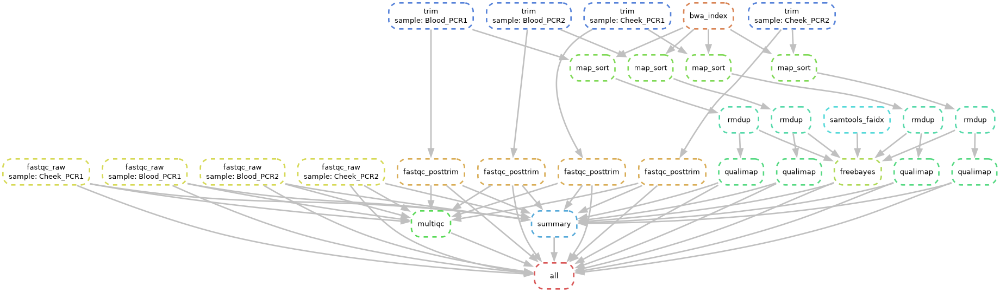

# Variant calling on human mtDNA — Snakemake workflow

Snakemake version of the Galaxy workflow used for the *Variant Call* assignment
(course "NGS", CQ Bildung): four Illumina single-end libraries from one individual
(blood and cheek, two PCR replicates each) are quality-checked, trimmed, mapped to the
human mitochondrial genome (`chrM`, 16 569 bp), de-duplicated, QC'd and jointly
genotyped with FreeBayes. A final Python step produces the tables and figures the
assignment asks for.

| Galaxy tool            | Snakemake rule      | Command                                          | Output               |
|------------------------|---------------------|--------------------------------------------------|----------------------|
| FastQC (raw)           | `fastqc_raw`        | `fastqc`                                         | `01_fastqc_raw/`     |
| Trimmomatic            | `trim`              | `trimmomatic SE -phred33 SLIDINGWINDOW:4:20 MINLEN:20` | `02_trimmed/`  |
| FastQC (trimmed)       | `fastqc_posttrim`   | `fastqc`                                         | `03_fastqc_posttrim/`|
| MultiQC                | `multiqc`           | `multiqc`                                        | `06_multiqc/`        |
| BWA-MEM + Filter SAM/BAM | `bwa_index`, `map_sort` | `bwa mem \| samtools view -F 4 \| samtools sort` | `04_bam/*.sorted.bam` |
| RmDup                  | `rmdup`             | `samtools rmdup -s`                              | `04_bam/*.nodup.bam` |
| Qualimap BamQC         | `qualimap`          | `qualimap bamqc`                                 | `05_qualimap/`       |
| FreeBayes              | `freebayes`         | `freebayes -f chrM.fasta *.nodup.bam` (joint)    | `07_vcf/all_samples.vcf` |
| IGV                    | `igv_report`        | `create_report` (igv-reports, by the IGV team)   | `09_igv/igv_report.html` |
| manual counting/tables | `summary`           | `scripts/summarize.py` (pandas)                  | `08_summary/`        |

Every figure comes from the same tools as in the Galaxy analysis: MultiQC writes its
plots as PNG (`multiqc --export`), Qualimap writes its own PNGs, and igv-reports
produces the IGV view of each variant. The Python step only builds the tables and
collects those figures — it does not plot anything itself.

Files in this folder:

```
Snakefile             the workflow (rules above)
config.yaml           samples, reference, trimming/FreeBayes parameters, threads
environment.yaml      conda environment with every tool (conda-forge + bioconda)
scripts/summarize.py  Python summary step (also usable on its own, see below)
chrM.fasta            reference (rCRS, 16 569 bp)
dag.png               the workflow graph (snakemake --dag)
06_multiqc/, 07_vcf/, 08_summary/, 09_igv/   results of the run (reports, VCF, tables, figures)
```

**Input data (not in the repository, 490 MB):** four single-end Illumina FASTQ files
from the course's Galaxy dataset — `Blood_PCR1.fastq`, `Blood_PCR2.fastq`,
`Cheek_PCR1.fastq`, `Cheek_PCR2.fastq` (76 bp reads, 0.5–0.9 M reads each). To re-run
the workflow, put them next to the `Snakefile`. Intermediate outputs (trimmed reads,
BAM files, per-sample FastQC/Qualimap folders) are not committed either; the workflow
regenerates them.



## 1. One-time setup on Windows (WSL + Miniforge)

The tools (BWA, samtools, FreeBayes, ...) are Linux programs, so on Windows they run
inside WSL (Windows Subsystem for Linux), exactly as in the course slides
(NGS-2, p. 6 and p. 25). This needs administrator rights once and one reboot.

**a. Install Ubuntu on WSL** — PowerShell *as administrator*:

```powershell
wsl --install -d Ubuntu
```

Reboot when asked. On first start Ubuntu asks for a Linux user name and password
(the password is not shown while typing). Open Ubuntu later via Start → "Ubuntu".

**b. Install Miniforge (conda + mamba) inside Ubuntu:**

```bash
sudo apt update && sudo apt install -y wget
wget "https://github.com/conda-forge/miniforge/releases/latest/download/Miniforge3-$(uname)-$(uname -m).sh"
bash Miniforge3-$(uname)-$(uname -m).sh
```

Accept the licence, keep the default location, answer **yes** to "initialize
Miniforge3", then close and reopen the Ubuntu terminal — the prompt should start
with `(base)`.

**c. Create the environment** (once; takes a few minutes, ~1.5 GB):

```bash
cd "/mnt/c/<path to this folder>"     # Windows' C: drive is /mnt/c inside WSL; quote paths with spaces
mamba env create -f environment.yaml
mamba activate ngs
```

**d. Chrome for the MultiQC plot export** (once). MultiQC renders its PNG plots with
kaleido, which drives a headless Chrome. Ubuntu on WSL has neither Chrome nor its
system libraries:

```bash
sudo apt install -y libnss3 libnspr4 libasound2t64
plotly_get_chrome -y
```

(If the environment already exists from an earlier version of this workflow, run
`mamba env update -f environment.yaml` first to get `igv-reports` and `python-kaleido`.)

The other way round, WSL files are visible in Windows Explorer under
`\wsl$\Ubuntu\home\<user>`. Running on the Linux file system (`cp -r` the folder to
`~/` first) is noticeably faster than on `/mnt/c`.

## 2. Run the workflow

From the workflow folder, with the `ngs` environment active:

```bash
snakemake -n                 # dry run: lists the 30 jobs without running anything
snakemake --cores 4          # run everything (≈ 20-30 min the first time)
```

Snakemake only (re)runs what is missing or outdated, so a second `snakemake --cores 4`
after a crash or after editing `config.yaml` continues where it stopped. Useful variants:

```bash
snakemake --cores 4 07_vcf/all_samples.vcf      # run up to one target only
snakemake --cores 4 --forcerun freebayes         # redo one rule (and what depends on it)
snakemake --dag | dot -Tpng > dag.png            # picture of the workflow graph
snakemake --report report.html                   # Snakemake's own HTML run report
```

## 3. Results: where to look for each assignment question

| Question | Tool (as in the Galaxy analysis) | Where |
|---|---|---|
| Q2 – quality untrimmed vs trimmed | MultiQC | `06_multiqc/multiqc_report.html`; table `08_summary/q2_trimming_qc.csv` (built from `multiqc_data/multiqc_fastqc.txt`); plot `06_multiqc/multiqc_plots/png/fastqc_per_base_sequence_quality_plot.png` |
| Q3/Q4 – mapping quality | Qualimap | `05_qualimap/<sample>/qualimapReport.html`; table `08_summary/q4_mapping_quality.csv` (from `genome_results.txt`); plots `images_qualimapReport/*.png` |
| Q5 – SNPs, heterozygous / homozygous | FreeBayes + IGV | `07_vcf/all_samples.vcf`; table `08_summary/q5_snp_counts.csv`; IGV view `09_igv/igv_report.html` |
| everything on one page | — | `08_summary/summary.md` (+ `08_summary/figures/`: the MultiQC and Qualimap PNGs) |

Expected numbers (this is what the course run and the Galaxy assignment gave, and what
`scripts/summarize.py` reproduces from those files):

* reads before → after trimming: 502 027 → 463 821 (Blood-PCR1), 880 238 → 835 878,
  775 186 → 719 376, 584 539 → 548 211; mean read length 76 → ≈67 bp
* after `-F 4` filtering and `rmdup`: ≈32 700–32 800 reads per sample, 100 % mapped,
  breadth of coverage 100 %, mean coverage ≈145×, mean mapping quality 59.99,
  error rate 0.23–0.24 %
* VCF: 47 records, 43 with `TYPE=snp`; per sample 12/3/9 or 11/2/9
  (total SNPs / heterozygous / homozygous). The "heterozygous" calls of the diploid
  model are heteroplasmic positions, e.g. chrM:8992 C>T at ≈25–30 % alternate allele
  fraction in all four samples.

The summary step can also be run by hand on any finished run (or on the course's
`files for exercises` folder) without Snakemake:

```bash
python scripts/summarize.py \
    --multiqc-table 06_multiqc/multiqc_data/multiqc_fastqc.txt \
    --multiqc-plot 06_multiqc/multiqc_plots/png/fastqc_per_base_sequence_quality_plot.png \
    --qualimap "05_qualimap/*/genome_results.txt" \
    --vcf 07_vcf/all_samples.vcf --igv-report 09_igv/igv_report.html --outdir 08_summary
```

## 4. Looking at the alignments in IGV

`09_igv/igv_report.html` (rule `igv_report`) is made by **igv-reports**, the IGV team's
tool for embedding IGV in a report: a table of all VCF records with each sample's
genotype, depth and allele counts, and — for the selected row — an igv.js browser
showing the reference, the VCF track and the four de-duplicated BAM pileups
(±100 bp). Open it in any browser; no installation needed.

The desktop IGV works too: download it from https://igv.org (Windows installer), load
`chrM.fasta` as genome (*Genomes → Load Genome from File*), then
`04_bam/<sample>.nodup.bam` (the `.bai` next to it is picked up automatically) and
`07_vcf/all_samples.vcf`. If the workflow ran inside WSL, the files are reachable from
Windows under `\wsl.localhost\Ubuntu\home\<user>\...`.

## 5. Notes and troubleshooting

* `Error: cores have to be specified` — Snakemake ≥ 8 requires `--cores N`.
* `Directory cannot be locked` — a previous run was interrupted: `snakemake --unlock`.
* Working on `/mnt/c` (OneDrive) is slower than the Linux file system. For a faster
  run copy the folder into WSL (`cp -r "/mnt/c/.../Snakemake_files" ~/` and run there),
  then copy `0*_*/` back. Pausing OneDrive sync while the workflow runs also helps.
* `samtools rmdup` is deprecated in recent samtools versions but still present; the
  modern equivalent is `samtools markdup -r` (after `samtools sort -n | fixmate -m |
  sort`). `rmdup -s` is kept here to reproduce the Galaxy "RmDup" step.
* FreeBayes is run with its defaults (diploid model, `--min-alternate-fraction 0.05`)
  to match the course; for a haploid mtDNA model set `freebayes: extra: "--ploidy 1"`
  in `config.yaml` (then no heterozygous genotypes are reported).
* Qualimap needs Java; the conda environment provides it. If it runs out of memory,
  add `--java-mem-size=4G` to the `qualimap` rule.
* `multiqc` fails with *Kaleido requires Google Chrome* or *The browser seemed to close
  immediately* — step 1d was skipped (Chrome or its libraries `libnss3 libnspr4
  libasound2t64` missing).
* `Snake_PCR` / `Snake_PCR.txt` are earlier drafts (FastQC only) superseded by `Snakefile`.
